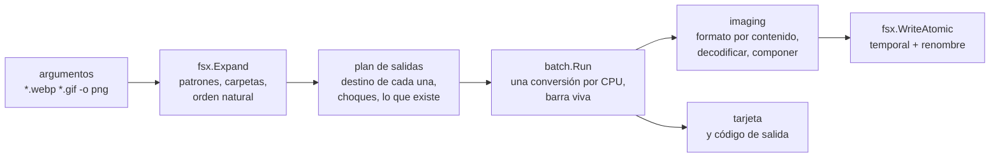

# img

<p>
  <a href="https://github.com/agustinyarrus/img/releases/latest"></a>
  <a href="https://github.com/agustinyarrus/img/actions/workflows/ci.yml"></a>
  
  
  
  <a href="LICENSE"></a>
</p>

Convertí imágenes en lote desde la consola de Windows. img pasa WebP, GIF (también animados), PNG, JPG, BMP y TIFF de un formato a otro, en paralelo y con una barra a la vista, con los colores exactos y sin pisar nada.

<p align="center">
  <picture>
    <source media="(prefers-reduced-motion: reduce)" srcset="demo/demo.png">
    
  </picture>
</p>
<p align="center"><sub>Una sesión real en una terminal de 100×30, grabada con <a href="https://github.com/charmbracelet/vhs">VHS</a> sobre doce imágenes de prueba generadas con ffmpeg · <a href="demo/demo.webm">en video</a> · <a href="demo/demo.tape">el guion</a> · <a href="demo/LEEME.md">cómo regrabarla</a></sub></p>

<details>
<summary>¿Sin imágenes? La misma sesión, en texto</summary>

```text
> img *.webp *.gif -o png

  img  ·  convierte imágenes entre formatos, en lote                                        v1.0.0


  ● 12 imágenes encontradas   ● 12 por convertir   ● destino .png

  ✓ cargando.gif   gif → png · 320×240 · 10,2 KB  (-94 %)
  ✓ automata.gif   gif → png · 320×240 · 11,6 KB  (-95 %)
  ✓ degrade-04.webp   webp → png · 1920×1080 · 93,7 KB  (+802 %)
  ✓ degrade-03.webp   webp → png · 1920×1080 · 93,0 KB  (+787 %)
  ✓ degrade-02.webp   webp → png · 1920×1080 · 93,3 KB  (+787 %)
  ✓ degrade-01.webp   webp → png · 1920×1080 · 95,2 KB  (+786 %)
  ✓ fractal-04.webp   webp → png · 1600×900 · 750 KB  (+673 %)
  ✓ fractal-05.webp   webp → png · 1600×900 · 1,05 MB  (+675 %)
  ✓ fractal-01.webp   webp → png · 1600×900 · 684 KB  (+986 %)
  ✓ fractal-03.webp   webp → png · 1600×900 · 914 KB  (+765 %)
  ✓ fractal-06.webp   webp → png · 1600×900 · 1,48 MB  (+690 %)
  ✓ fractal-02.webp   webp → png · 1600×900 · 1,31 MB  (+897 %)


     img · png

     ● Convertidas      12         ● Cambio de peso   +473 %
     ● Tamaño final     6,58 MB    ● Tiempo           2,22 s
```

</details>

Un único `.exe` de unos 3 MB, en Go puro: sin instalador, sin nube; las imágenes no salen de la máquina. Antes vivía en navaja, una suite de herramientas de consola para Windows; ahora es un proyecto propio.

[Por qué](#por-qué) · [Instalar](#instalar) · [Uso](#uso) · [Recorrido](#recorrido) · [Cómo funciona](#cómo-funciona) · [Cómo se verificó](#cómo-se-verificó) · [Límites](#límites)

## Por qué

Windows muestra una WebP en el navegador o en Fotos, pero no trae nada para convertir una carpeta entera desde la consola; lo habitual es instalar ImageMagick o ffmpeg, que resuelven eso y mil cosas más. Y convertir bien tiene sus trampas, que una herramienta chica puede resolver una por una:

- **Los colores de una WebP con pérdida dependen de quién la decodifica.** VP8 guarda luma y croma en BT.601 de rango limitado, con el croma a la mitad de resolución. Tratarlo como un JPEG (rango completo, el croma del píxel más cercano), que es lo que hace la conversión estándar de Go, corre los colores hasta 20 niveles. img replica la aritmética de libwebp, el decodificador de Chrome, y los deja iguales al bit.
- **Un GIF animado no guarda cuadros, guarda cambios.** Cada cuadro suele ser el rectángulo que cambió, con una regla para limpiar el anterior. Exportar esos recortes da fragmentos; img compone cada cuadro como se ve en pantalla.
- **La transparencia no existe en JPEG.** Hay que aplanarla sobre algún color, y blanco no siempre es el que querés.
- **Nadie expande `*.webp` por vos.** Ni cmd ni PowerShell expanden comodines para un programa nativo: `*.webp` le llega tal cual. img entiende `*`, `?`, `[]` y `**`.
- **Convertir no tiene que costar un original.** Dos entradas pueden ir a la misma salida (`logo.webp` y `logo.gif` → `logo.png`), un Ctrl+C puede cortar a mitad de un archivo.

## Instalar

Bajá `img.exe` de la [última release](https://github.com/agustinyarrus/img/releases/latest) y copialo a una carpeta del `PATH`. Es el programa entero: Windows 10 u 11 de 64 bits (se probó en Windows 11), sin instalador. Al lado viene `SHA256SUMS` para comprobarlo:

```powershell
(Get-FileHash .\img.exe -Algorithm SHA256).Hash -eq ((Get-Content .\SHA256SUMS) -split '\s+')[0]   # True
```

El `.exe` es reproducible: la misma etiqueta compilada con el mismo Go da los mismos bytes en cualquier máquina ([cómo](docs/RELEASE.md#5-el-exe-es-reproducible)).

Con [Go](https://go.dev/dl) 1.26 o más nuevo (con un Go 1.21+ más viejo, Go baja solo la versión que pide el `go.mod`):

```powershell
go install github.com/agustinyarrus/img@latest
```

Desde el repo:

```powershell
.\build.ps1          # dist\img.exe, con la versión, el commit y el SHA256
.\build.ps1 -Test    # antes, go vet y todas las pruebas
```

El único módulo externo es [`golang.org/x/image`](https://pkg.go.dev/golang.org/x/image) (los lectores de WebP, BMP y TIFF); todo lo demás es la biblioteca estándar.

## Uso

```powershell
img *.webp                                # cada .webp a .png, al lado del original
img *.webp *.gif -o png                   # varias a la vez, en la carpeta png\
img fotos\ -r --to jpg -q 82              # una carpeta entera, con subcarpetas, a JPEG
img spinner.gif --frames                  # un GIF animado → spinner-001.png, spinner-002.png…
img insignia.webp --to jpg -b '#0b0b0f'   # aplanar la transparencia sobre un fondo oscuro
```

| Flag | Qué hace |
|---|---|
| `--to png\|jpg\|gif\|bmp\|tiff` | el formato de salida (png) |
| `-q`, `--quality N` | calidad JPEG, de 1 a 100 (90) |
| `--frames` | de un animado, cada cuadro a un archivo |
| `-b`, `--background COLOR` | el fondo al aplanar la transparencia hacia JPEG o BMP: `#rgb`, `#rrggbb`, `#rrggbbaa`, `blanco`, `negro`, `transparente` (blanco) |
| `--fast` | PNG con compresión rápida en vez de la máxima |
| `-o`, `--out-dir DIR` | la carpeta de salida (por defecto, junto al original) |
| `-r`, `--recursive` | entrar en subcarpetas |
| `-f`, `--force` | sobrescribir si el destino ya existe |
| `-j`, `--jobs N` | cuántas conversiones en paralelo (0 = una por CPU) |

Flags al estilo GNU (`-q 82`, `--quality=82`, `-rf`, `--`); un flag mal escrito sugiere el más parecido. Respeta `NO_COLOR` y `--no-color`; si la salida no es una consola, no emite ni un escape. Códigos de salida: `0` todo bien · `1` algunas imágenes fallaron · `2` línea de comandos inválida · `3` no se pudo hacer nada · `130` cancelado con Ctrl+C.

<details>
<summary><code>img --help</code>, entera</summary>

```text
> img --help

  img  ·  convierte imágenes entre formatos, en lote                                        v1.0.0

  uso
    img <archivos|carpetas|patrones…> [opciones]
    img *.webp                 cada .webp a .png, al lado del original
    img foto.gif --to jpg      un gif a jpg (primer cuadro)

  qué producir
        --to png|jpg|gif|bmp|tiff   formato de salida (png)
    -q, --quality N                 calidad JPEG 1–100 (90)
        --frames                    de un animado, exportar cada cuadro a un archivo
    -b, --background COLOR          fondo al aplanar transparencia hacia JPEG/BMP (blanco)
        --fast                      PNG con compresión rápida en vez de la máxima

  de dónde y a dónde
    -o, --out-dir DIR               carpeta de salida (por defecto, junto al original)
    -r, --recursive                 entrar en subcarpetas al pasar una carpeta
    -f, --force                     sobrescribir si el destino ya existe
    -j, --jobs N                    cuántas conversiones en paralelo (0 = una por CPU) (0)

  general
    -h, --help                      muestra esta ayuda
    -V, --version                   muestra la versión
        --no-color                  salida sin colores (también respeta NO_COLOR)

  ejemplos
    img *.webp                            el caso típico: toda la carpeta de webp a png
    img fotos/ -r --to jpg -q 82          recorrer una carpeta y pasar todo a jpg
    img loader.gif --frames               romper un gif animado en loader-001.png, …
    img logo.webp --to jpg -b '#0b0b0f'   aplanar el alfa sobre un fondo oscuro

  notas
    · El formato se detecta por el contenido, no por la extensión (un .png que en realidad es webp
      se convierte igual).
    · Nunca se borra el original ni se sobrescribe sin --force.
    · webp no se puede ESCRIBIR (no hay codificador en Go puro); sí leer.
```

</details>

## Recorrido

Todas las salidas de esta sección son reales: img 1.0.0 en una consola de 100 columnas, sobre imágenes de prueba en una carpeta montada como `X:\dev\galeria`, capturadas el 28/9/2026. En la consola van con los colores de la demo; acá, sin ellos.

### No pisa nada

`logo.webp` y `logo.gif` irían los dos a `logo.png`. img lo ve antes de convertir: convierte uno y saltea el otro, con el motivo. Lo mismo si el destino ya existe (sin `--force`, nunca se sobrescribe) o si es el propio origen.

```text
> img logo.webp logo.gif

  img  ·  convierte imágenes entre formatos, en lote                                        v1.0.0


  ● 2 imágenes encontradas   ● 1 por convertir   ● destino .png

  ↷ logo.gif   chocaría con logo.webp
  ✓ logo.webp   webp → png · 512×512 · 317 KB  (+752 %)


     img · png

     ● Convertidas      1          ● Tamaño final     317 KB     ● Tiempo           332 ms
     ● Salteadas        1          ● Cambio de peso   +752 %
```

### Los cuadros de un GIF animado

Con `--frames`, cada cuadro compuesto a tamaño completo, numerado en orden:

```text
> img spinner.gif --frames -o cuadros

  img  ·  convierte imágenes entre formatos, en lote                                        v1.0.0


  ● 1 imagen encontrada   ● 1 por convertir   ● destino .png   ● cuadro por archivo

  ✓ spinner.gif   gif · 160×120 → 8 cuadros · 8,70 KB


     img · png

     ● Convertidas         1                      ● Cambio de peso      -24 %
     ● Archivos escritos   8                      ● Tiempo              30 ms
     ● Tamaño final        8,70 KB
```

### La transparencia, sobre el fondo que elijas

Una insignia redonda con las esquinas transparentes, a JPEG sobre el fondo de una consola oscura en vez de blanco:

```text
> img insignia.webp --to jpg -b '#0b0b0f'

  img  ·  convierte imágenes entre formatos, en lote                                        v1.0.0


  ● 1 imagen encontrada   ● 1 por convertir   ● destino .jpeg

  ✓ insignia.webp   webp → jpeg · 512×512 · 15,5 KB  (+889 %)


     img · jpeg

     ● Convertidas      1          ● Cambio de peso   +889 %
     ● Tamaño final     15,5 KB    ● Tiempo           10 ms
```

### Errores que ayudan

Un flag mal escrito sugiere el más parecido (distancia de Damerau–Levenshtein), y un archivo que no existe, el más parecido de la misma carpeta:

```text
> img fractal-01.webp --to jpg --qualty 85

  ✗ no conozco --qualty; ¿quisiste decir --quality?
  › img --help muestra todas las opciones
```

```text
> img fractal-1.webp --to jpg

  img  ·  convierte imágenes entre formatos, en lote                                        v1.0.0

    ! fractal-1.webp   no existe; ¿quisiste decir fractal-01.webp?

    ✗ No hay imágenes para convertir   revisá los patrones o la extensión
```

## Cómo funciona

### Una corrida



1. `fsx.Expand` resuelve los patrones y las carpetas (con `-r`, recursivo) y se queda con las imágenes, en orden natural. Lo que no existe se informa, con el nombre más parecido, y no corta la tanda.
2. **El plan de salidas**, antes de tocar nada: para cada entrada, su destino (la misma carpeta u `--out-dir`, la extensión nueva) y si procede. Se saltea, con el motivo, si el destino es el propio archivo, si ya existe sin `--force` o si otra entrada ya reclamó esa salida. La comparación no distingue mayúsculas, como NTFS.
3. `batch.Run` convierte en paralelo (una conversión por CPU, o `--jobs`) con la barra viva: el conteo, el porcentaje y los archivos en curso. Cada resultado se guarda por índice, así el resumen es el mismo aunque terminen desordenados, y un pánico en una conversión es un fallo de esa conversión, no de la tanda.
4. La tarjeta final resume convertidas, salteadas, fallidas, el tamaño final y el cambio de peso; de ahí sale el código de salida.

### El formato, por el contenido

La extensión puede mentir (una WebP guardada como `.png` aparece seguido al bajar imágenes de la web). img mira los primeros bytes: `\x89PNG`, `GIF87a`/`GIF89a`, `RIFF…WEBP`, `BM`, `II*\0`/`MM\0*` y la marca de JPEG. Recién después elige el decodificador.

### Colores de WebP iguales a libwebp

`golang.org/x/image/webp` entrega la imagen como YCbCr 4:2:0 y deja la conversión a RGB a cargo de quien la usa. [`webpcolor.go`](internal/imaging/webpcolor.go) la hace con la aritmética de libwebp (`src/dsp/yuv.h` y `src/dsp/upsampling.c`):

- **BT.601 en rango limitado, en punto fijo de 14 bits**, con las mismas constantes. Por ejemplo, `R = clip((19077·Y >> 8) + (26149·V >> 8) − 14234)`, con 6 bits de fracción al final.
- **El croma interpolado 9-3-3-1.** Cada píxel toma su croma de las cuatro muestras vecinas, con pesos 9, 3, 3 y 1 según la distancia, en vez de copiar la más cercana. libwebp calcula los dos promedios diagonales una vez por par de píxeles y empaqueta U y V en un solo entero para interpolarlos con una suma; img hace lo mismo, con el mismo recorrido de filas (la primera sola, después de a pares, la última sola si la altura es par).
- **El alfa va tal cual**, sin premultiplicar, como libwebp en modo RGBA.

El resultado coincide al bit con libwebp: 18 de 18 casos de estrés idénticos (abajo, [cómo se verificó](#cómo-se-verificó)). Es O(píxeles).

### GIF animados: componer cada cuadro

Un GIF guarda, para cada cuadro, un rectángulo y un método de disposición que dice qué hacer con él antes del siguiente. [`gifcompose.go`](internal/imaging/gifcompose.go) reconstruye cada cuadro sobre un lienzo del tamaño lógico del GIF:

- se dibuja el rectángulo del cuadro sobre el lienzo y se toma una copia: ese es el cuadro tal como se ve;
- después se aplica su disposición: **ninguna** (el lienzo queda), **restaurar al fondo** (su rectángulo vuelve a transparente) o **restaurar al anterior** (el lienzo vuelve a como estaba antes de dibujarlo, para lo que se guardó una instantánea).

Cuesta O(cuadros × píxeles). Hacia un formato sin animación va el primer cuadro; con `--frames`, cada cuadro a su archivo; y hacia GIF, el animado entero.

### Escribir sin romper nada

- **Atómica.** Toda salida va a un temporal en la misma carpeta y se renombra al final: un corte o un Ctrl+C nunca deja un archivo a medias ni pisa el anterior. El renombre se reintenta con espera exponencial, porque un antivirus o un visor pueden tener el destino abierto un instante.
- **La transparencia** se conserva hacia PNG y TIFF y se aplana sobre `--background` hacia JPEG y BMP. Hacia GIF se pierde: la paleta de salida no reserva un transparente (ver [Límites](#límites)).
- **GIF de salida** con la paleta fija de Plan 9 (256 colores) y difusión de error de Floyd–Steinberg; un GIF animado a GIF sigue animado, con sus tiempos y su bucle. **PNG** con la compresión máxima (o la rápida, con `--fast`).

### La consola

La barra, la tarjeta y la ayuda son el mismo núcleo que usan las otras herramientas de la familia: la región viva se redibuja a 20 cuadros por segundo con las líneas permanentes por encima, la barra tiene resolución de un octavo de columna, los números van en formato es-AR (miles con punto, decimales con coma) y, en Windows Terminal, el avance también se ve en el ícono de la pestaña. Si la salida no es una consola, nada de eso: texto plano, línea por línea.

Más detalle, paquete por paquete: [docs/ARQUITECTURA.md](docs/ARQUITECTURA.md).

## Cómo se verificó

La regla: img no se contrasta consigo misma. Pillow, que decodifica las WebP con libwebp y los JPEG con libjpeg, es el lector independiente, y la comparación es píxel a píxel.

| Qué | Contra qué | Resultado |
|---|---|---|
| WebP con pérdida | [`webp_stress.py`](internal/imaging/_oracle/webp_stress.py): 18 casos generados con Pillow, de 1×1 a 333×201, ruido de color puro, con y sin alfa, y bloques de color | 18 de 18 idénticos al bit a libwebp |
| las imágenes de prueba (WebP sin y con pérdida, con alfa, GIF estático y animado, BMP, JPEG) | [`pixel_all.ps1`](internal/imaging/_oracle/pixel_all.ps1) + [`pixel_check.py`](internal/imaging/_oracle/pixel_check.py) | 6 de 6 iguales al bit; el JPEG, a 1 nivel (dos decodificadores de JPEG no tienen por qué coincidir al bit: la norma no fija el redondeo de la IDCT). Un control con el origen equivocado tiene que dar diferencias, y las da |

- **56 pruebas de Go** (`go test ./...`). Las de `imaging` leen imágenes de prueba que genera [`scripts/fixtures.ps1`](scripts/fixtures.ps1) con ffmpeg; sin ellas, cinco se saltean y lo dicen.
- **CI en `windows-latest`** con el Go mínimo del `go.mod` ([`ci.yml`](.github/workflows/ci.yml)): formato, `go vet` (también para Linux), ffmpeg para las imágenes de prueba y todas las pruebas sin salteadas, el `.exe` con su versión y su SHA256, y los dos oráculos de Pillow sobre ese `.exe`.

El detalle, con la lección de los 20 niveles de color: [docs/VERIFICACION.md](docs/VERIFICACION.md).

## Límites

- **No escribe WebP.** No hay codificador de WebP en Go puro: img las lee pero no las escribe.
- **WebP animadas, no.** `golang.org/x/image/webp` solo lee imágenes estáticas; hace falta leer el contenedor animado y componer sus cuadros, como ya se hace con los GIF.
- **El GIF de salida es el más flojo.** Usa una paleta fija (la de Plan 9) en vez de una armada para cada imagen, así que un degradé suave pierde matices, y no reserva un color transparente: la transparencia se pierde. Para convertir *desde* GIF no hay problema; para convertir *a* GIF, mejor PNG si se puede.
- Se compila y se prueba para `windows/amd64`. Lo puro compila en cualquier sistema (la CI corre `go vet` para Linux), pero img está pensada y probada para Windows.

Lo que falta, en orden: [docs/PENDIENTE.md](docs/PENDIENTE.md).

## Estructura

```
main.go               abre la consola y llama a img.Main
internal/
  img/                la herramienta: flags, plan de salidas (choques), la tanda y la tarjeta
  imaging/            formato por contenido, decodificar, componer GIF, color de WebP, codificar
    _oracle/          webp_stress.py, pixel_check.py y pixel_all.ps1, contra Pillow
  batch/              tareas en paralelo con barra viva y resultados en orden
  fsx/                patrones con **, orden natural, escritura atómica
  cli/                flags estilo GNU, ayuda, "¿quisiste decir…?"
  tui/                consola: paleta, región viva, tarjetas, formato es-AR
  textdist/           distancia de Damerau–Levenshtein
  win/desk/           modo y tamaño de la consola, por syscall
  version/            versión y commit, estampados por build.ps1
scripts/fixtures.ps1  las imágenes de prueba, con ffmpeg
demo/                 la grabación del README, su guion de VHS y cómo se arma la escena
docs/                 arquitectura, verificación, pendientes y cómo se arma una release
.github/              la CI: formato, vet, pruebas, oráculos y el .exe con su SHA256
build.ps1             compila dist\img.exe con la versión y el commit (-Test: antes, vet y pruebas)
```

## Licencia

[MIT](LICENSE).
